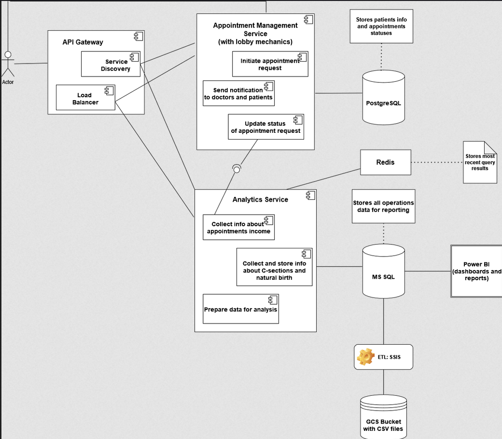

# Maternity Hospital Platform
Maternity Hospital Platform is a distributed system which serves a private maternity hospital with a focus on two main directions: an ability to create a doctor appointment for patients and provide the set of real-time dashboards and reports for key stakeholders and head (business) department. 

## Microservice Architecture Suitability 
As it was already meantioned, the project will cover two pretty independant core functionalities - ordering doctor appointment online and provideing statistics for key stakeholders. That is why microservice artitecture is the best choice to separate those functionalities on two services which will process its data, store it in their own databases and which will be independent in terms of development, deployment ans scaling. It is planned to have at least tree levels of users: 

* **Patients** who will be able to log in and order a specific doctor appointment by choosing date, time and doctor;
* **Doctors** who will receive patients' request for an appointment for a specific date/time and will be able to reject/approve those requests based on the schedule;
* **"Stakeholder" users** who will monitor dashboards and reports to make key business decisions.

## Service Boundaries
### Appointment management service
This service will be responsible for doctor appontment management: initiating request for appointment and changing its further statuses: waiting for approvement, approved/rejected, completed. The lobby mechanics will be implemented for this service:
1. A patient selects the doctor and date/time for the appointment;
2. The doctor logs to the platform and subscribes for the Websocket channel;
3. Appointment service sends a notification to the doctor when new appointment request is available for him;
4. The doctor can either approve or reject the request;
5. After the request gets its status (approved or rejected), the patient recieve a real-time notification about it via WebSocket;
6. The status of the appointment is saved/updated into the database for Appointment Management Service.

### Analytics service
The service will be responsible for collecting, storing and delivering data for future dashboards and reports, in other words, it will be responsible for making data accessible for business analysis:
1. Collect data from different sources. It is planned to process data from the cloud (GCS bucket with CSV files );
2. Store the data in Analytics service database;
3. Deleiver data for dashboards, reports or user request from UI

### System Architecture Diagram


## Technology Stack and Communication
* **Appointment management service**: C# (.NET Core) + SignalR for WebSocket, PostgreSQL, Redis (Cache)
* **Analytics service**: C# (.NET Core), MS SQL, Redis (Cache)
* **API Gateway**: Python (FastAPI)
* **User-service communication**: RESTful API
* **Inter-service communication**: gRPC (data will be transaferd in Protobuf format)

**Inter-service communication**: there will be transferred data about income from different doctor appointments and then will be used for reporting and analysis.

## Data Management
### Core endpoints for Appointment management service:
1. **POST/appointments**:
Allows patient to make a request for doctor appointment:
```
{
  "patientId": "12345",
  "doctorId": "56789",
  "preferredTime": "2024-09-20T15:00:00",
  "reason": "Routine Check-up"
}
```
As a success result returns appointment id, as failure returns error message.
**Success**:
```
{
  "status": "success",
  "appointmentId": "abc123",
  "message": "Appointment request submitted successfully and waits for confirmation."
}
```
**Failure**:
```
{
  "status": "error",
  "message": "Unable to request an appointment."
}
```

2. **GET /appointments/{doctorId}**:
Allows doctors to retrive pending appointment requests.

**Success**:
```
{
  "status": "success",
  "appointments": [
    {
      "appointmentId": "abc123",
      "patientId": "12345",
      "patientName": "John Doe",
      "preferredTime": "2024-09-20T15:00:00",
      "reason": "Routine Check-up"
    },
    {
      "appointmentId": "def456",
      "patientId": "67890",
      "patientName": "Jane Smith",
      "preferredTime": "2024-09-21T09:00:00",
      "reason": "Follow-up Consultation"
    }
  ]
}
```

**Failure**:
```
{
  "status": "error",
  "message": "No pending appointments for this doctor."
}
```
3. **PUT /appointments/{appointmentId}**:
Allows doctor to accept or reject the requested appointment.

**Accept**:
```
{
  "status": "accepted",
  "confirmedTime": "2024-09-20T15:00:00"
}
```

**Reject**:

```
{
  "status": "rejected",
  "reason": "Doctor unavailable at the preferred time."
}
```

### Core endpoints for Analytical service:
1. **GET /reports/doctor-performance**:
Returns the performance metrics for a particular doctor.

**Success**:
```
{
  "status": "success",
  "doctorId": "56789",
  "doctorName": "Dr. Jane Doe",
  "startDate": "2024-09-01",
  "endDate": "2024-09-30",
  "performanceMetrics": {
    "totalCSections": 5,
    "totalNaturalBirths": 10,
    "totalWorkingDays": 22,
    "averagePatientSatisfaction": 4.8
  }
}
```
**Failure**:
```
{
  "status": "error",
  "message": "No data found for the specified doctor or date range."
}
```

2. **GET /reports/revenue**:
Returns profit and revenue metrics for maternity hospital.

**Success**:
```
{
  "status": "success",
  "startDate": "2024-01-01",
  "endDate": "2024-09-30",
  "totalRevenue": 1000000,
  "totalProfit": 300000,
  "profitMargin": 0.3,
  "departmentBreakdown": {
    "maternity": {
      "revenue": 600000,
      "profit": 150000,
      "profitMargin": 0.25
    },
    "surgery": {
      "revenue": 400000,
      "profit": 150000,
      "profitMargin": 0.375
    }
  }
}
```

**Failure**:
```
{
  "status": "error",
  "message": "No revenue data available for the specified period or department."
}
```

## Deployment

Docker Compose will be used for project deployment. Each service will be containerized, ensuring that dependencies are isolated and consistent across different environments. Docker Compose simplifies running, scaling, and managing the services by defining them in a single docker-compose.yml file, making it easy to deploy, stop, and scale your microservice architecture.